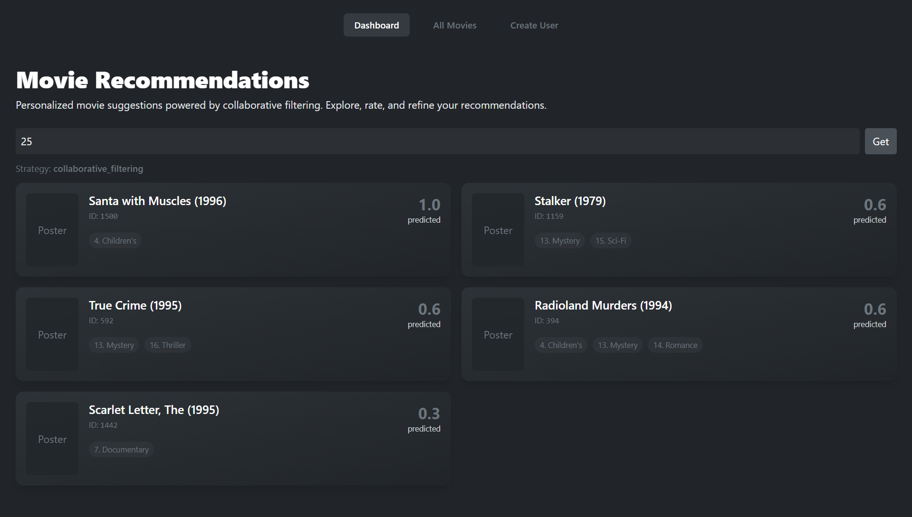
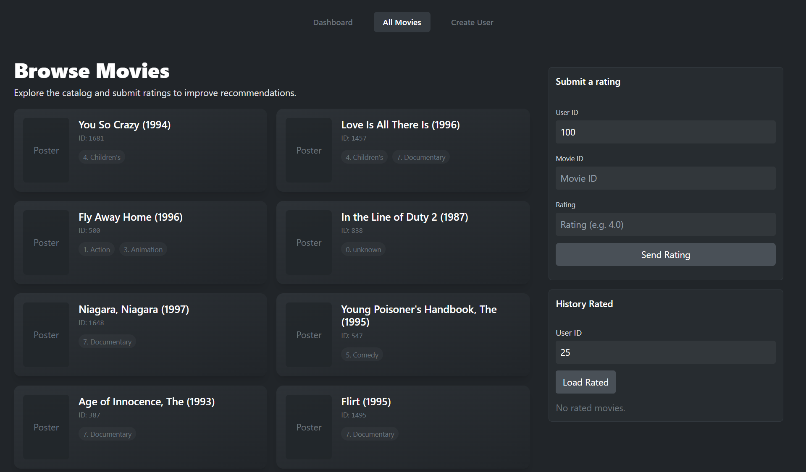
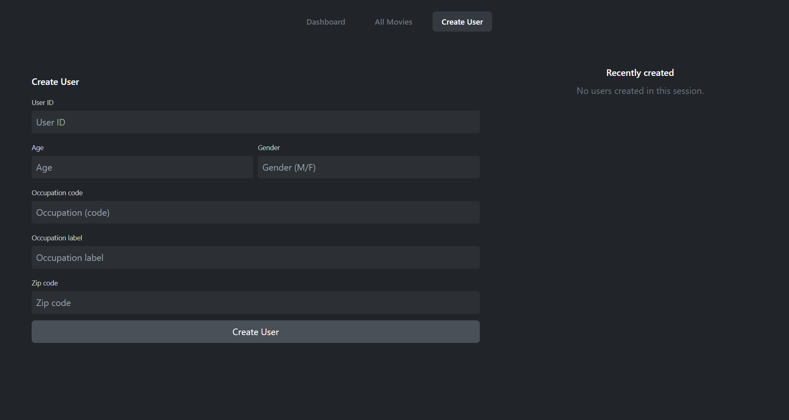

# Movie Recommender

Deskripsi:
Aplikasi ini adalah demo sistem rekomendasi film hybrid (collaborative filtering + content-based + popular fallback). Terdiri dari backend (Flask + TensorFlow Recommenders, SQLite) dan frontend (React + Vite, Tailwind).

Quickstart:
- Jalankan backend: lihat `backend/README.md` (virtualenv, `python migrate.py`, `python server.py`).
- Jalankan frontend: lihat `frontend/README.md` (npm install, `npm run dev`).

# Screenshots

Dashboard

Browse Movies

Create User
